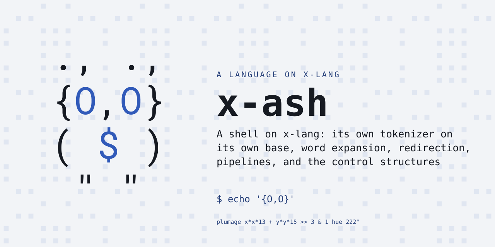
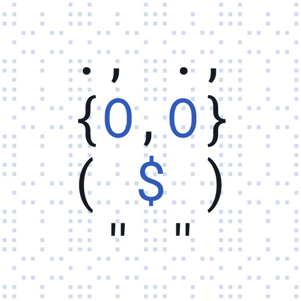

# x-ash — a POSIX shell on x-lang

<p align="center"></p>

A shell on [x-lang](https://github.com/jonruttan/x-lang): its own tokenizer on
its own base, word expansion, redirection, pipelines, and the control
structures.

```
$ x -l ash
$ echo hello | grep h
hello
$ for f in a b c; do echo $f; done
a
b
c
```

## What the shell has

Words and quoting: single quotes (literal), double quotes (expanding),
backslash escapes inside and outside them. Quoting applies to a *region* of a
word rather than to the word, so `X="a b"`, `pre"mid"post`, `"$HOME"/bin` and
`'a'"$b"` are each one word.

Expansion: `$NAME`, `${NAME}`, `$?`, `$$`, `$#`, `$@`, `$*` and `$1`…`$9`
(`${10}` and up for the rest) — anywhere in a word, not only at the start of
one. An unset name expands to nothing.

Command substitution: `$(...)` and the older `` `...` ``, nested, and inside
double quotes. Trailing newlines come off, as POSIX asks.

Arithmetic expansion: `$((...))` — integers in decimal, octal (`010`) or
hexadecimal (`0x10`), `+ - * / %` (division truncates toward zero),
comparisons, the bitwise `& | ^ ~` and the shifts `<< >>`, `&&` / `||` / `!`,
the conditional `c ? a : b`, parentheses, and bare names read as their values
(unset or non-numeric is zero; blanks around a value and a sign in front of it
are allowed, so a count `wc` pads still reads). `&&`, `||` and the
conditional evaluate only the side they take, so `$((n && total/n))` guards
its own division. A counting loop is `i=$((i+1))`.

Parameter expansion: `${X:-default}`, `${X:=assign}`, `${X:?message}`,
`${X:+alternative}` and their colonless forms (which treat a null value as
set), `${#X}` for length, and `${X#p}` / `${X##p}` / `${X%p}` / `${X%%p}` to
remove a matching prefix or suffix — so `${P##*/}` and `${P%/*}` are basename
and dirname.

Field splitting: an unquoted expansion splits on whitespace and a quoted one
does not, so `X="a b"; cmd $X` passes two arguments and `cmd "$X"` one. An
unquoted expansion of nothing produces *no* argument; `""` produces an empty
one. `for f in $(cat list)` iterates once per line.

Structure: pipelines, `&&` / `||` / `;` / `&`, `if`/`elif`/`else`, `while`,
`until`, `for`, `case`, `!` negation, `( ... )` subshells and `{ ...; }`
groups.

`case` patterns are globs: `*`, `?`, `[abc]`, `[a-z]`, `[!abc]`, and `\` to
escape any of them. A pattern is expanded as it is compared — `case $x in
$prefix*)` reads the parameter — and what quoting makes literal stays
literal: `"*"` looks for a star, and `"$p"` matches the text `$p` holds.

Pathname expansion: an unquoted `*`, `?` or `[...]` in a word is matched
against the filesystem, and the word becomes the sorted list of what it
matched — `*.txt`, `sub/*/x`, `/dev/nul?`, and `*/` for directories only. A
pattern that matches nothing stands as written, which is POSIX's default. A
leading dot is matched only by a pattern that starts with one, and quoting
suppresses the whole thing: `"*"`, `'*'` and `\*` are all a literal star.

Functions: `name()` followed by any compound command — `{ ... }`, `( ... )`,
`if`, `for`, `while`, `until` or `case` — and the redirections written after
it, which are expanded at each call. `$1`…, `$#` and `$@` are scoped to the
call and restored afterwards, `return [n]` leaves early, and `shift [n]`
moves the arguments along. A function shadows a builtin or an external of the
same name, except the special builtins POSIX lists (`:` `.` `break` `continue`
`eval` `exec` `exit` `export` `readonly` `return` `set` `shift` `times` `trap`
`unset`), which run whatever functions there are; `command NAME` runs the
builtin or external.

Here-documents: `<<EOF` and `<<-EOF` (which strips leading tabs), with the body
expanded unless the delimiter is quoted. The body ends at the delimiter with
its quoting removed, and quoting any part of it (`'EOF'`, `"EOF"`, `\EOF`,
`E"O"F`) counts. Several on one line are taken in order. One can open inside
a command substitution in double quotes, as in `x="$(cat <<EOF`, and `<<`
inside a quoted string, over however many lines, is text.

Redirection: `<`, `>`, `>>`, `<>`, `>&`, `<&`, on builtins as well as externals
— and on a builtin the descriptors are put back afterwards, so `echo x > log`
does not leave the shell writing to `log`. A redirection written after a
compound (`for ...; done > log`) applies to the whole construct. `exec` with
redirections and no command applies them to the shell itself. A number in
front of the operator names the descriptor: after `exec 3<file`, `read x <&3`
reads the file's next line. A file `>` or `>>` creates has permission 0666
less the umask, and one already there keeps its mode; `<>` opens its file for
reading and writing, creating it if need be.

Builtins: `echo` (with `-n`), `cd`, `pwd`, `export`, `local`, `unset` (`-f`
for functions, `-v` for variables), `read`, `set`, `test` / `[`, `.` /
`source`, `eval`, `exec`, `getopts`, `command`, `type`, `trap` (EXIT only),
`return`, `shift`, `exit`, `true`, `false`, `:`. A word one of them takes as a
variable's name must be a NAME — a letter or underscore, then letters, digits
and underscores — and so must a function's name and a `for` loop's variable.

`command NAME [arg...]` runs NAME as though no function had that name, and
`command -v NAME` answers what would run: a builtin, function or reserved word
as written, a name holding a `/` as written, and anything else as the first
file on PATH that could be executed. `-V` says what the name is rather than
what would run. `-p` is refused rather than ignored, a script that asks for a
trusted PATH not being one to hand the untrusted one to. `type NAME...` says
what each name is the way `-V` does, and answers 1 when any is found nowhere.

`local NAME[=VALUE]...` in a function gives each name a value for the call and
puts the old one back at the end — its value, its export attribute, and any
`readonly` mark given to it inside. A function called from this one sees the
local. A name given no value starts unset, which is bash's reading rather than
dash's, and `local` outside a function is refused.

`set -- a b c` replaces the positional parameters; `set -e` exits on a failed
command, `-u` makes an unset parameter an error, `-x` traces to stderr, `-f`
turns off pathname expansion, `-o pipefail` makes a pipeline fail when any
stage does, and `set +e` (etc.) turns each back off. `-e` is suppressed where
a failure is the point — a condition, `!`, and any operand of an AND-OR list
but the last. An `o` among a cluster's letters takes its name from the words
after the cluster, so `set -euo pipefail` is the three.

`IFS` is honoured: whitespace runs collapse to one delimiter, a non-whitespace
delimiter keeps empty fields (`IFS=:` over `a::b` is three), and an empty `IFS`
suppresses splitting entirely.

`test` knows `-n`, `-z`, `!`, `=`, `!=`, `<` and `>` (by byte); the file
predicates `-e` `-f` `-d` `-s`, `-L`/`-h` for a symbolic link, `-p` `-S` `-b`
`-c` for the other kinds, and `-u` `-g` `-k` for the setuid, setgid and
sticky bits; `-t FD`; `-nt` and `-ot` by modification time; and the numeric
comparisons `-eq` `-ne` `-lt` `-le` `-gt` `-ge`. Up to four words are read
by how many there are, as POSIX sets out; more are an expression, where `!`
binds tighter than `-a` and `-a` tighter than `-o`, and `(` `)` group. An
unknown operator is a usage error (status 2), not a silent false. `-r`, `-w`,
`-x` and `-ef` are not implemented: they need access(2) and device and inode
numbers, which the platform does not yet reach.

Not implemented: an action on a signal (`trap` takes one for EXIT alone), and
job control.

Subshells: `( ... )` forks, and the interpreter has no flush primitive, so a
child's buffered output can be lost if the parent exits first. It prints
correctly to a terminal and through a pipe; the spec suite asserts subshell
*status* rather than subshell stdout for this reason.

At the prompt, an entry that is not finished continues on a `> ` line — an
unclosed quote, a trailing `|` or `&&` or backslash, an `if`/`for`/`while`/
`until`/`case` whose closer has not been typed yet, or a function body whose
closer is still to come.

There is a prompt when there is someone to prompt: the banner and PS1 and PS2
appear when the shell's own input and its reports are both terminals, and the
prompts go to standard error. A script piped in or read from a file is run
without either, so its stdout holds what its commands wrote and nothing else.

x-ash is a **lang**: a surface syntax loaded over an x-lang dialect, so a
spelling shared with x-lang can mean something different here — `;` separates
commands rather than starting a comment, and `#` starts one rather than
dispatching. It tokenizes on its own base to do that. The terms are in x-lang's
[lang contract](https://github.com/jonruttan/x-lang/blob/main/docs/lang-contract.md).

## Status

513 specs, all green against x-lang **v0.13.0**, the release `lang.xon`
declares. x-lang v0.7.1 or later is required: it is the first release pinning
an engine in which an isolated tokenizer base works, and this shell does not
run without one.

## Install

From any directory, nothing cloned:

```bash
x --install-lang https://github.com/jonruttan/x-ash/releases/latest/download/lang.pin.xon
x -l ash
```

x fetches the published pin, then the tarball it names, verifies the digest,
and installs to `<share>/langs/ash`, where `x -l` looks. A failed upgrade
leaves the working install untouched.

From a clone:

```bash
make install                      # into the x on your PATH
PREFIX=$HOME/.local make install  # or a particular prefix
```

`make uninstall` removes it either way. An installed x searches
`<share>/langs/*/lang.xon`; a lang is installed when its files are there.
There is no registry.

`make install` ends with `x --image -l ash`, which saves the booted shell to
`.images/` beside the bundle; `x -l ash` then loads that instead of re-reading
the sources (about 0.9s against 3.5s) for as long as the image's key matches
the library and the engine. The tokenizer base and `$$` belong to the running
process rather than the heap and are remade after an image loads.
`x --no-image -l ash` boots from source.

`x` resolves langs relative to the directory it runs in. Inside an x-lang
checkout it searches `deps/langs/` only, so an installed lang is not found
there:

```
$ cd path/to/x-lang && x -l ash
Error: no library, app or lang named 'ash'
  searched lib/ash.x, apps/ash/run.x
      and deps/langs/*/lang.xon
```

Run `x` from another directory, or set `X_LANG_DIR`, which takes precedence in
both cases:

```bash
X_LANG_DIR=$HOME/.local/share/x/langs/ x -l ash   # the installed one
X_LANG_DIR=/path/to/x-ash/.. x -l ash             # a checkout, uninstalled
```

The dialect is helium: what the shell needs from the platform is `x/sys/posix`
and `x/sys/file`, imported by name in `ash/prims.x`, and nothing in the larger
dialects.

## Pin it for a project

An install is unversioned and machine-wide. When a project must build against
a specific version, pin it: `Pin bundle` fetches the release tarball and
verifies it against a digest before unpacking. In the project's
`lang.pin.xon`:

```x
(lang "ash")
(release "v0.1.4")
(bundle "sha256:…" "https://github.com/jonruttan/x-ash/releases/download/v0.1.4/x-ash-v0.1.4.tar.gz")
(source "https://github.com/jonruttan/x-ash.git")
```

Each release's notes carry this block with its digest, ready to paste. Then:

```x-repl
> (import x/tool/pin)
> (Pin bundle "deps/langs")
"deps/langs/ash-v0.1.4"
```

`deps/langs/` is where `x -l` looks in a checkout; `X_LANG_DIR` overrides it.

Install when you just want `x -l ash` to work. Pin when a build depends on it:
the digest is what makes the version reproducible.

## Running it

```bash
x -l ash                # interactive
x -l ash -f script.sh   # batch
```

x-lang boots the dialect `lang.xon` declares, arms this bundle's module root,
and loads `run.x` on top.

## Development

Run the specs against an x-lang checkout or install:

```bash
X=/path/to/x-lang/x.sh make test    # the suite
X=/path/to/x-lang/x.sh make check   # the suite against the contract, which CI gates on
make bundle                         # roll a release tarball and print its pin
```

Pass `X` explicitly: without it the suite takes the `x` on your PATH, and an
installed x that trails the checkout — or a locally built `x-bin` older than
the engine the release pins, which `x.sh --engine-path` prefers — reports
failures the platform has already fixed.

Do not `make install` into an x-lang checkout. The Makefile asks
`$(X) --share-dir` where to put the bundle, and a checkout answers with its own
root, so the files land in `<checkout>/langs/ash`, which `-l` does not search
there. The install reports success and the lang is still not found. Install
into a real `<share>` tree, or use `X_LANG_DIR`.

Known failures are recorded by name in
[`tests/contract/known-failures.txt`](tests/contract/known-failures.txt).
`make check` is red when a failure appears that is not listed and when a
listed one starts passing, so the list can only shrink. It is currently empty:
any failure is a regression.

The release tarball is byte-reproducible: it is built from the tag with
`git archive` and a timestamp-free gzip, so the same tag always yields the same
digest. Pushing a `v*` tag runs the suite and, only if it is green, publishes
the tarball, its `.sha256` and `lang.pin.xon` as a GitHub release. CI runs the
declared release and x-lang `main`, so a platform change that breaks this
bundle shows up as a red build.

## Layout

```
lang.xon          name, dialect, and the x-lang release this pairs with
run.x             the entry point
ash/prims.x       the platform layer, under the names ash was written against
ash/tokens.x      shell token types, on an isolated tokenizer base
ash/eval.x        parser and evaluator in one pass
ash/printer.x     Scheme-style `write` for token lists
ash/repl.x        the $ prompt and the -f batch reader
```

## Background

The language is POSIX's Shell Command Language: the Bourne shell's syntax
(V7 Unix, 1979) as the standard later pinned it down — words rather than
values, expansion rather than evaluation, and a grammar in which `;` and
newline are the sequencing operators, which is why this bundle needs its own
tokenizer base.

It shares its name with the small-shell lineage begun by Kenneth Almquist's
`ash` (1989), which lives on as Debian's `dash` and BusyBox's `sh` — shells
that implement the standard and stop, which is this bundle's scope too.

- [Shell Command Language](https://pubs.opengroup.org/onlinepubs/9699919799/utilities/V3_chap02.html) — POSIX.1-2017, the language being implemented
- [Ash variants](https://www.in-ulm.de/~mascheck/various/ash/) — Sven Mascheck's history of the lineage
- [dash](http://gondor.apana.org.au/~herbert/dash/) — the lineage's current mainline

## Licence

MIT No Attribution (MIT-0). See [LICENSE](LICENSE).

<p align="center"></p>
